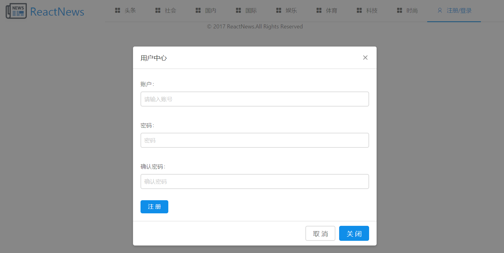
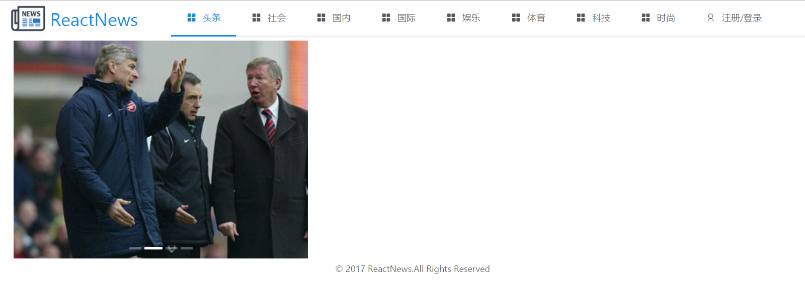
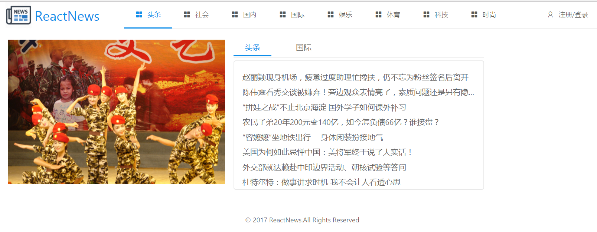
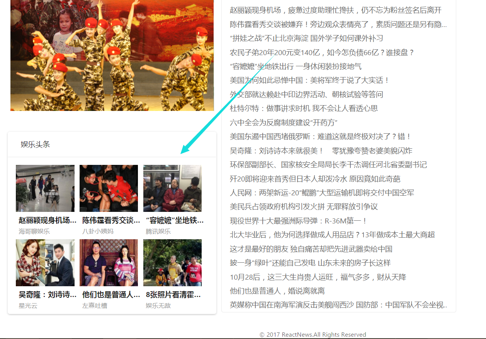
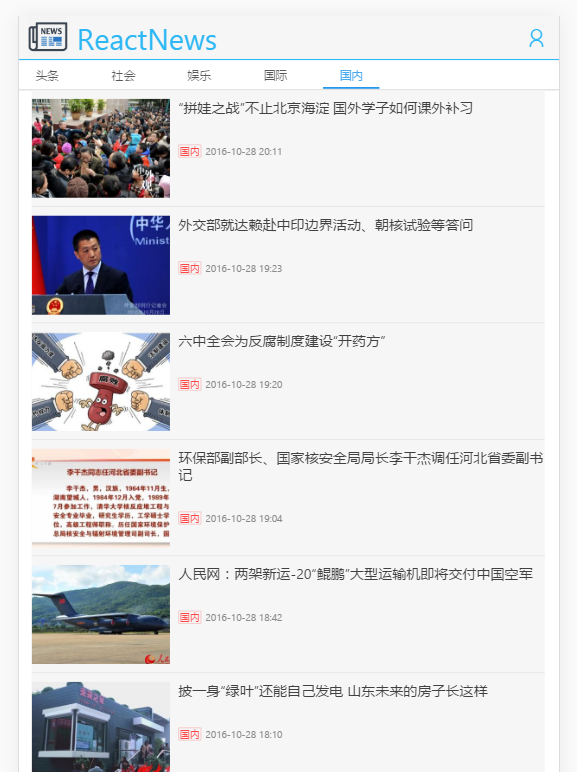
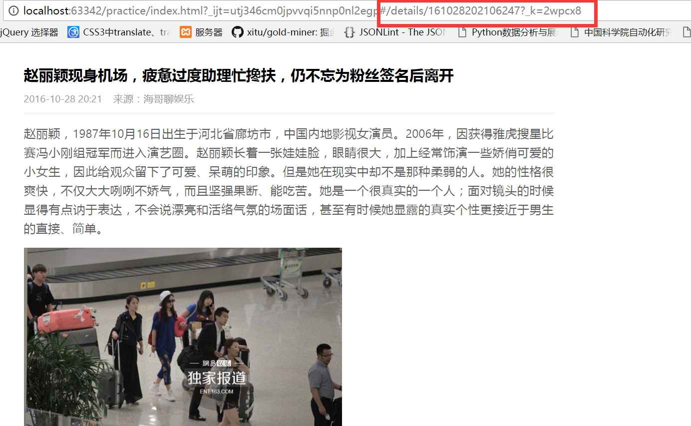
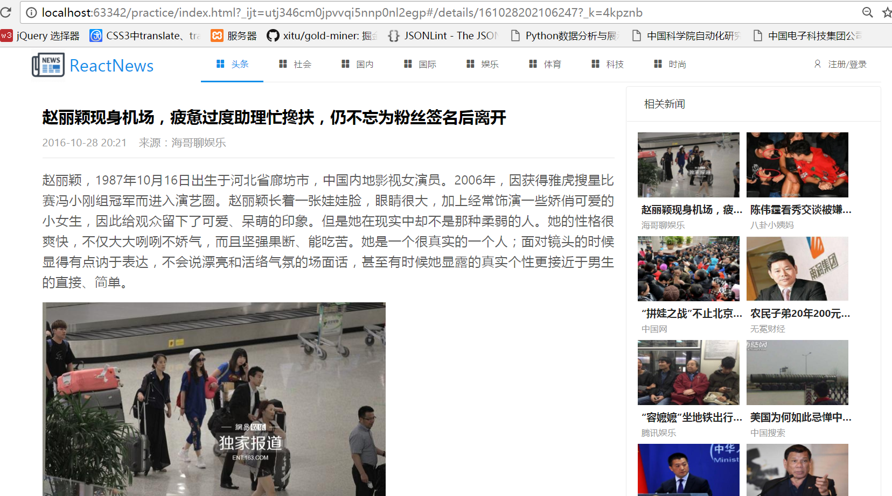

# 使用ant design

# 响应式：react-responsive

 npm install react-responsive --save

(适配手机端、pc)

# [fetch 框架](https://github.com/github/fetch)  

其他的js项目中也可用

# 执行

**开始先做头部和底部，中间暂未，目前是“注册/登陆”模态框，采用ant design**

**轮播图（使用ant design 的Carousel）**

**新闻模块tabs**

**图片模块**

**目前手机端的显示：新闻分类**

**点击首页的右侧新闻，路由转到details/下的页面信息，details/后的是根据数据取的:uniquekey值**

**紧接着上面的路由界面增添图片新闻模块**

